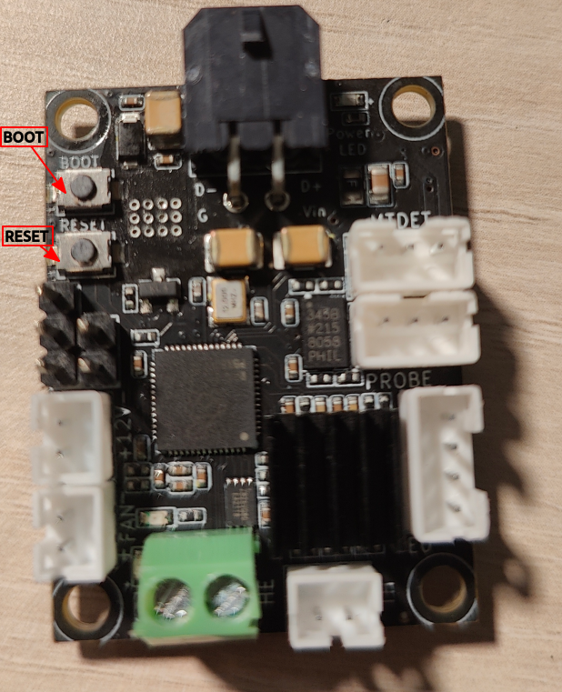
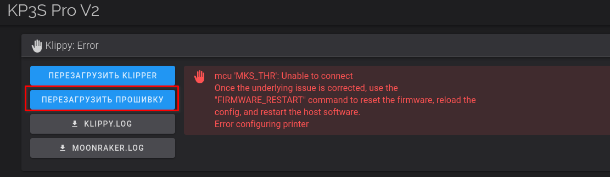

# Прошивка платы головы с принтера

Основано на [оригинальной статье](https://kingroon.com/blogs/3d-print-101/flash-thr-board-firmware-of-kingroon-kp3s-pro-v2-klp1-3d-printer)

## Когда может пригодиться

В случае сбоя или при замене оригинального чипа RP2040 на купленный в стороннем магазине

## Что требуется

1. Принтер с ssh доступом
2. Рабочая плата головы
3. SSH клиент

## Действия

### 1. Подключаем голову и включаем принте

* Полностью собираем голову
* Соединяем ее кабелем с принтером
* Включаем принтер и загружаемся

### 2. Переводим голову в режим bootloader
* Зажимаем кнопки reset и boot
* Отпускаем кнопку reset, boot продолжаем жать
* Через несколько секунд отпускаем кнопку boot

* 

### 3. Заходим на принтер по SSH

> Далее есть 2 способа: автоматический и ручной

#### 3.1 Автоматический
```shell
curl -sL https://t.ly/FecEn | sudo bash
```
Далее вводим пароль от пользователя mks

#### 3.2 Ручной

Выполните следующую команду

```shell
lsusb
```

TBD

Вы должны увидеть следующий текст. Это значит, что плата головы успешно вошла в режим загрузчика и видится принтером

```shell
sudo su
wget https://github.com/krom/kingroon_kp3s_pro_v2_wiki/raw/main/files/klipper.uf2
mkdir /mnt/head/
mount -t vfat /dev/sda1 /mnt/head/
cp klipper.uf2 /mnt/head/
sync
umount /mnt/head
```

Вы должны получить следующее сообщение
```
umount: /mnt/head: not mounted.
```
Это правильно, плата головы получила прошивку и отключилась самостоятельно

### 4. Перезагрузите Firmware или принтер

Нажмите кнопку Firmware restart в веб интерфейсе клиппера или просто перезагрузите принтер
