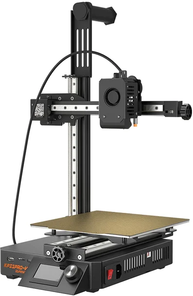

# База знаний по принтеру Kingroon KP3S Pro V2 [RU]

* [Мануалы](manuals)
  * [SSH доступ](manuals/SSH_ru.md)
  * [Настройка шагов экструдера](manuals/rotation_distance_ru.md)
* [Известные проблемы](known_issues)
  * [Пластиковые проставки под платой на голове](known_issues/MKS_THR_Spacers_ru.md)
  * [Недостаточно затянутое сопло](known_issues/Nozzle_not_tight_ru.md) 
* [Советы по печати](tips)
  * [Клей](tips/Printing_glue_ru.md)
* [Апгрейд](upgrade)
  * [Улитка обдува](upgrade/Blower_ru.md)
  * [Хитблок от CHC](upgrade/CHC_ru.md)
* [Ремонт](repair)
  * [Прошивка платы головы из принтера](repair/How_to_flash_THR_Board_from_printer_ru.md)

# Kingroon KP3S Pro V2 Wiki [EN]
* [Manauls](manuals)
* [Known issues](known_issues)
* [Tips and tricks](tips)
* [Upgrade](upgrade)
* [Repair](repair)

----
[Группа в Telegram](https://t.me/kingroon_printers/384212)