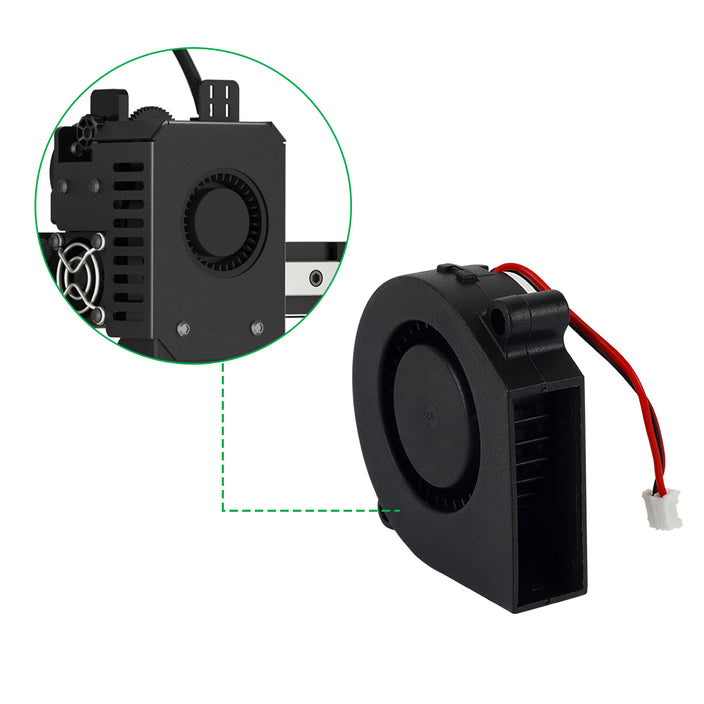

# Штатная улитка обдува не регулируется

Штатная улитка очень громкая и не умеет регулировать обороты - либо слабо, либо 100%

Есть 2 варианта решения данной проблемы:
1. Покупка рабочей улитки с [официального сайта](https://kingroon.com/collections/kingroon-kp3s-pro-v2-replacement-parts-accessories/products/5015-blower-fan-24v-12v-for-kingroon-kp3s-pro-v2-klp1) - не проверялось
2. Установка другой улитки с заменой охлаждения [по инструкции](../upgrade/Blower_ru.md) - рекомендуется