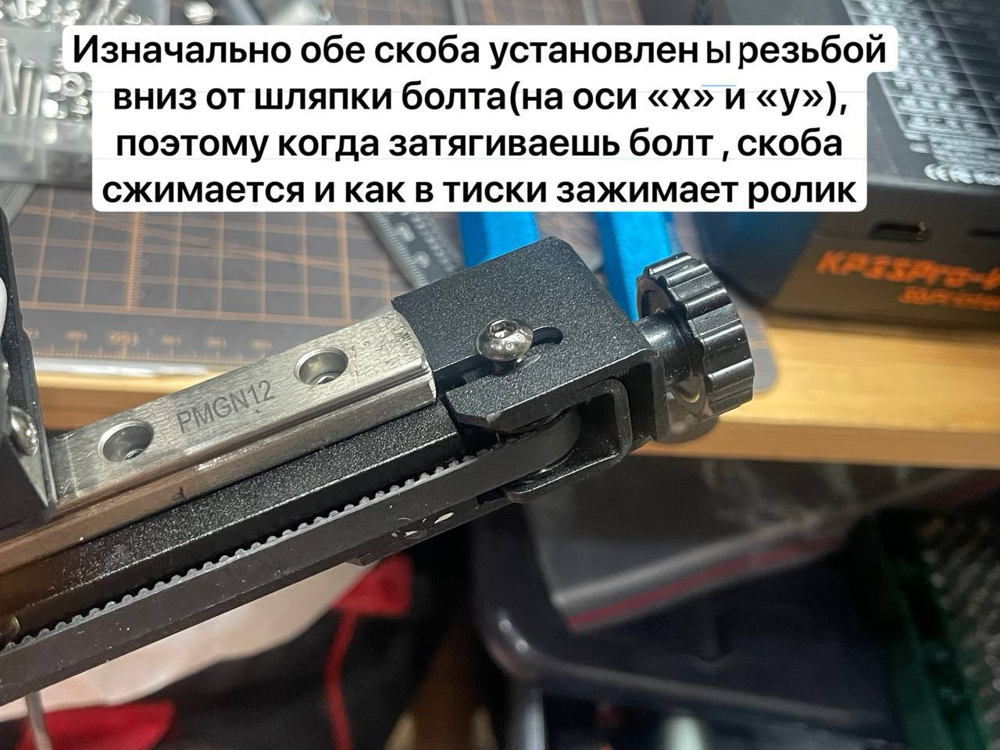
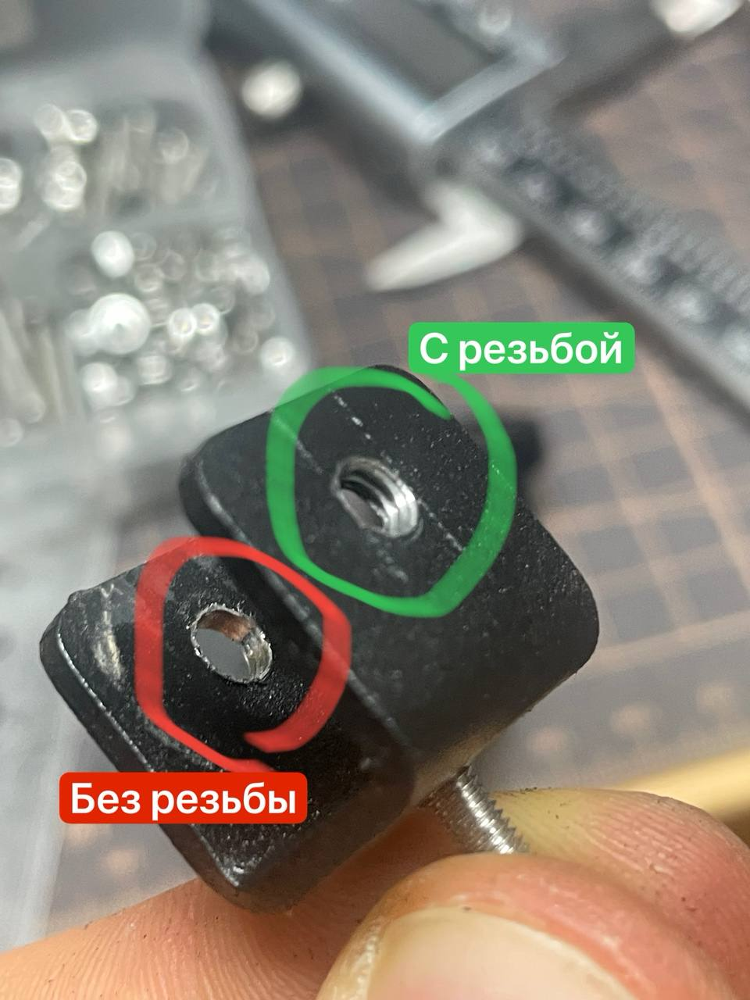
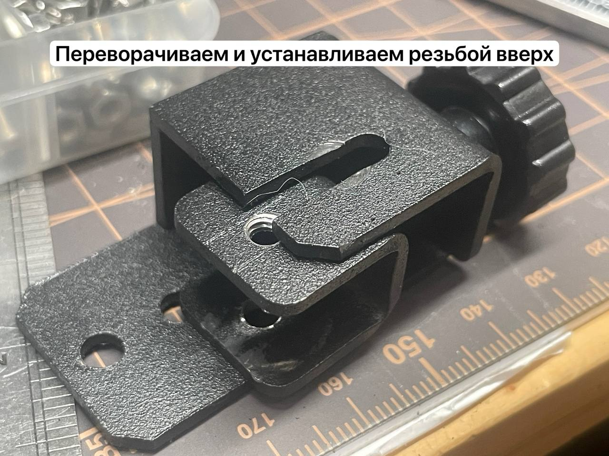
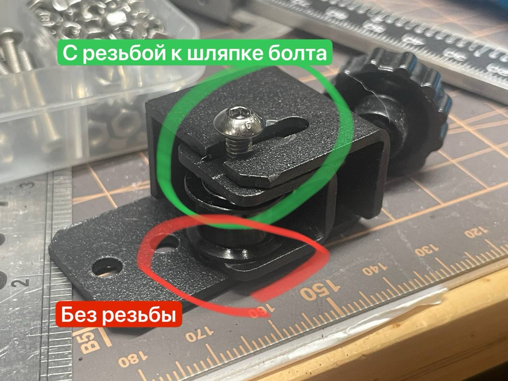

# Перевернутая скоба натяжителя ремня

Скоба натяжителя на оси х и у имеет 2 отверстия. Одно с резьбой, второе почти без, что позволяет винту прокручиваться в нем . И изначально эти скобы установленны резьбой вниз (дальняя часть скобы от шляпки болта фиксирующего ролик ) из за этого при затягивании болта скоба сжимается и начинает тереть о ролик .

Что предлагаю сделать:

- Выкручиваем винт натяжителя
- выкручиваем винт фиксирующий скобу
  - снимаем скобу
  - если уже перетягивали его, то исправляем геометрию скобы (плоскогубцами или руками)
- переворачиваем скобу так, чтобы резьба была ближе к шляпке болта.
- устанавливаем ремень с роликом
- наживляем винт (проверяем чтобы резьба была сверху у того места с короной вкручиваем винт)
- устанавливаем на место
- Закручиваем регулировочный барашек и натягиваем ремень.
- и теперь можно нормально затянуть винт фиксатора, не боясь погнуть скобу и не боясь заблокировать ролик .

Спасибо [@kireevk](https://t.me/kireevk)