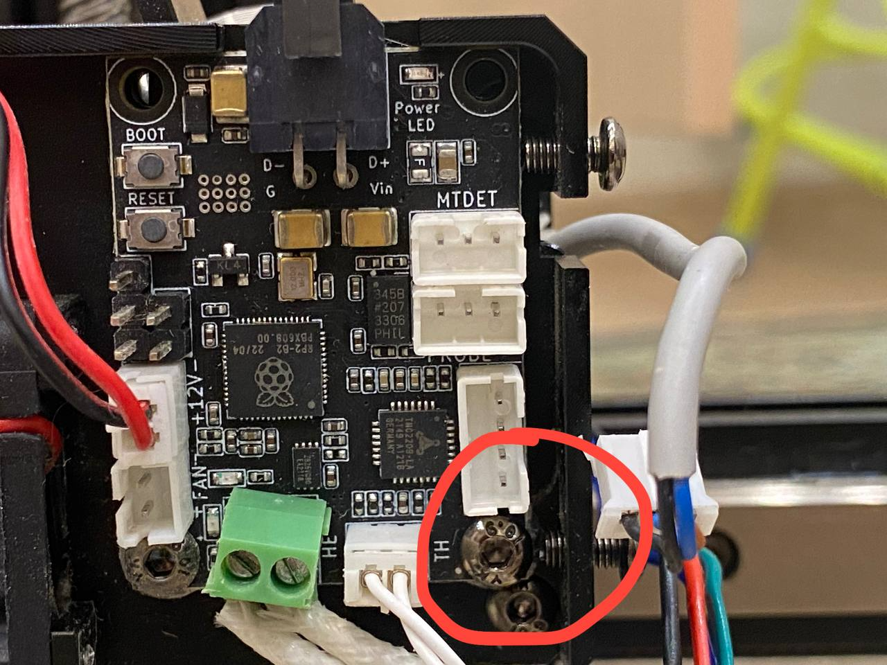
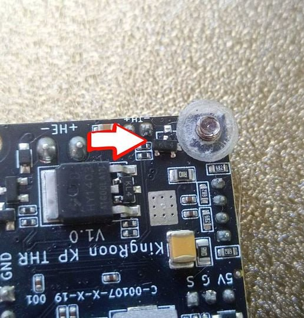

# Пластиковые проставки под платой на голове

При проектировании/сборке головы разработчики прогадали с размером проставок излориующих плату от экструдера. Это приводит к сдвигу диода шотки и обычно выходу из строя как платы головы, так и платы принтера

> **Внимание!**
> Данная проблема наблюдается только на первых ревизиях головы, на актуальной этих проставок уже нет