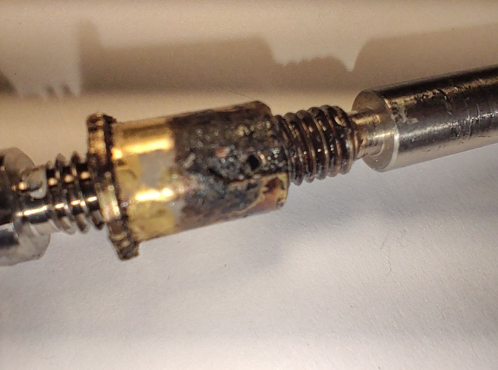

# Nozzle is not tight

Manufacturers periodically ship printers with insufficiently tightened necks and nozzles. This causes the plastic to flow under the ceramic ring and break it.

Therefore, after purchasing a printer, it is worth tightening the nozzle to a hot one. You must be extremely careful when doing this, as the heating element is very fragile.