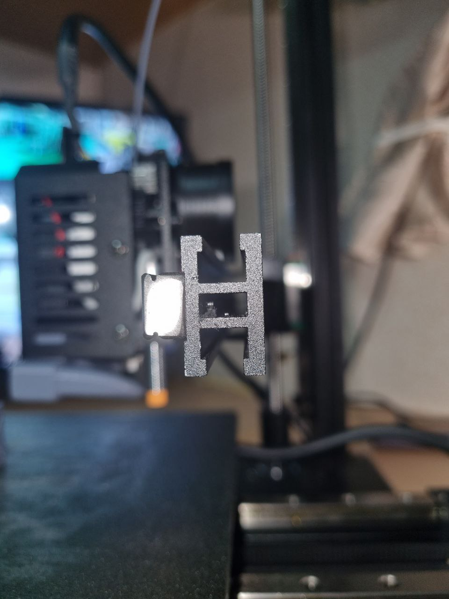
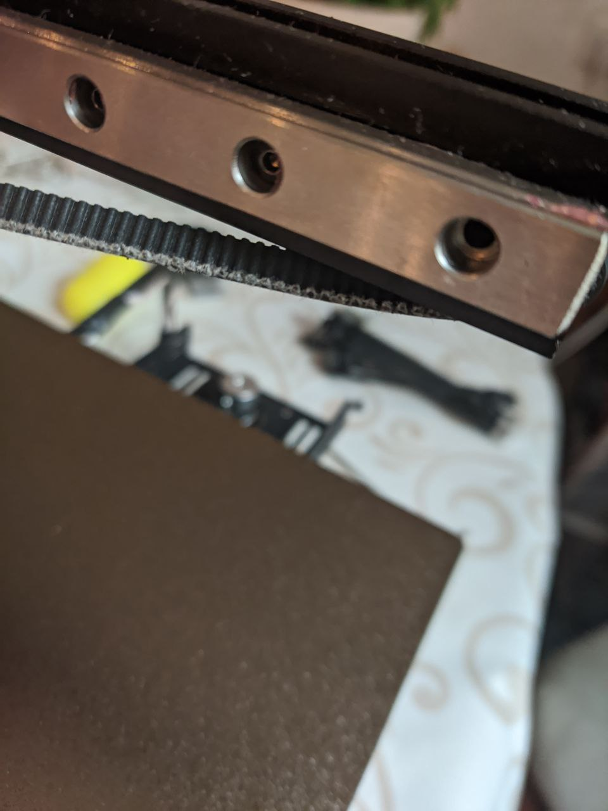

# Торчащие внутри балки X винты
В принтере перемещение по оси X происходит при помощи ремня, закрепленного обоими концами на голове. 

Сама голова с всеми ее компонентами при этом скользит по рельсе, закрепленной на балке оси X. 
Верхняя часть ремня проходит через отверстие вдоль всей балки оси X, и с одной стороны балки выходит на шестеренку мотора, 
а с другой стороны проходит через натяжитель. 

Как выяснилось, винты, которыми вышеупомянутая рельса привинчена к балке, слишком длинные. 

Их концы **торчат внутри** внутрь отверстия балки, и мешают свободно ходить расположенному внутри балки ремню, **цепляются за него**!   

В результате концы винтов постоянно скребут по краю ремня, повреждая его и вызывая дополнительные вибрации головы принтера: 

Для исключения данной проблемы можно либо немного укоротить длину винтов, либо заменить их на более короткие. 
Проблемные винты имеют длину резьбы 7.5 мм, чтобы они не цепляли ремень нужно укоротить их примерно на 2 - 2.3 мм.
