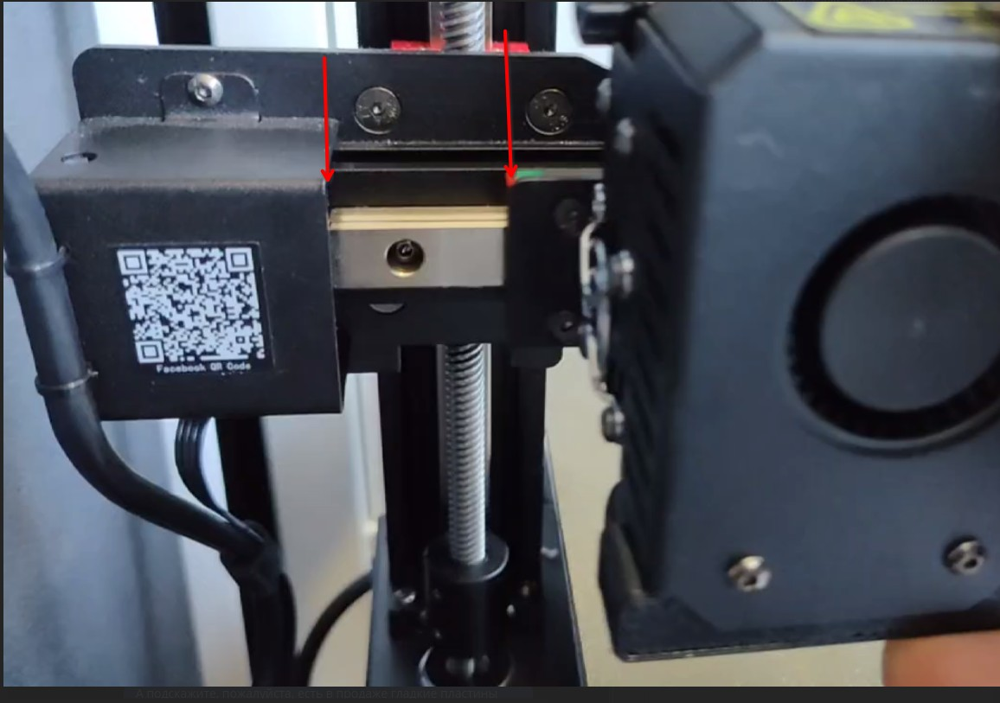
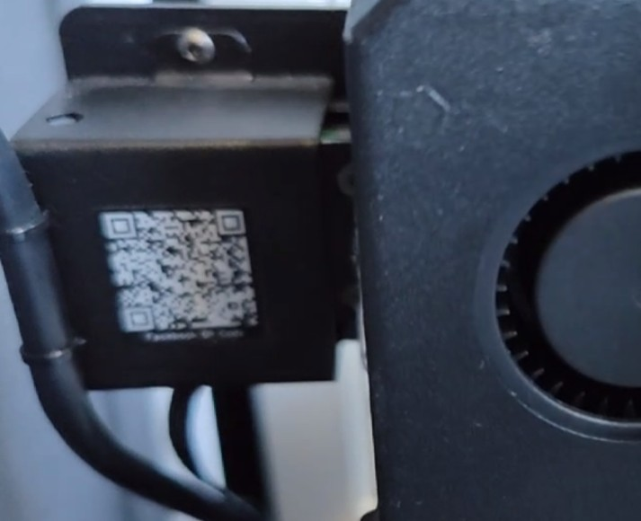
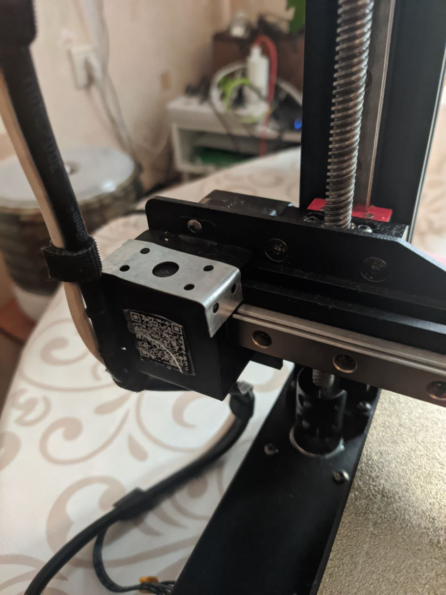

# Проблема со стопором по оси X
В принтере вместо концевика используется датчик тока шагового двигателя когда подвижная часть упирается в неподвижную ответную часть

На балке оси X подразумевается, что балка с подшипниками упирается в скобу слева

Однако, она может проскользнуть внутрь

Чем это грозит:
1. Сдвиг оси X примерно на 10 мм, т.е. печать на 5 мм будет происходить в воздухе за пределами стола
2. Рельса выходит из балки и обнажаются подшипники, что может приводить к их засорению или даже выпаданию

Рекомендуется поставить дополнительный упор по типу такого
