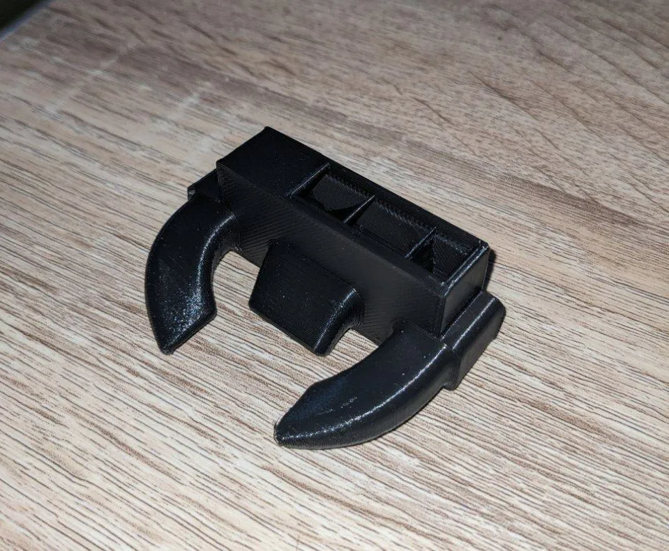

# Улитка обдува

Штатная улитка очень громкая и не умеет регулировать обороты - либо слабо, либо 100%

Рекомендуется сразу же заменить на что-то типа этого
* [Подороже, но тише](https://www.ozon.ru/product/ventilyator-5015-12v-gdstime-radialnyy-ulitka-s-sharikopodshipnikami-dual-ball-828114165/?sh=i03j4qX8Ag)
* [Подешевле, но попроще](https://www.ozon.ru/product/933032956/?avtc=1&avte=2&avts=1695473214&sh=i03j4rB2rg)

### Важно
Под новые вентиляторы надо распечатать новый обдув, т.к. штатная улитка имеет нестандартные размеры

Скачать файлы можно по [ссылке](https://www.printables.com/model/531258-fan-duct-kp3s-pro-v2-with-display)

