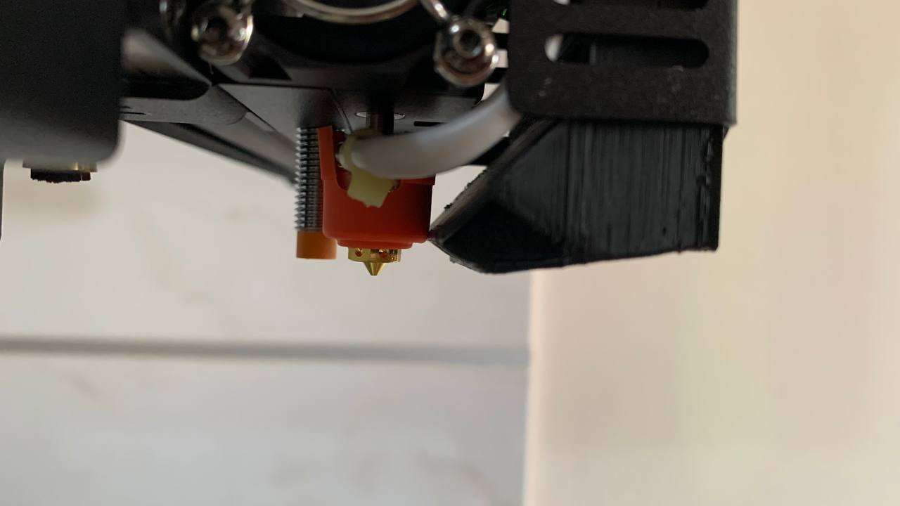
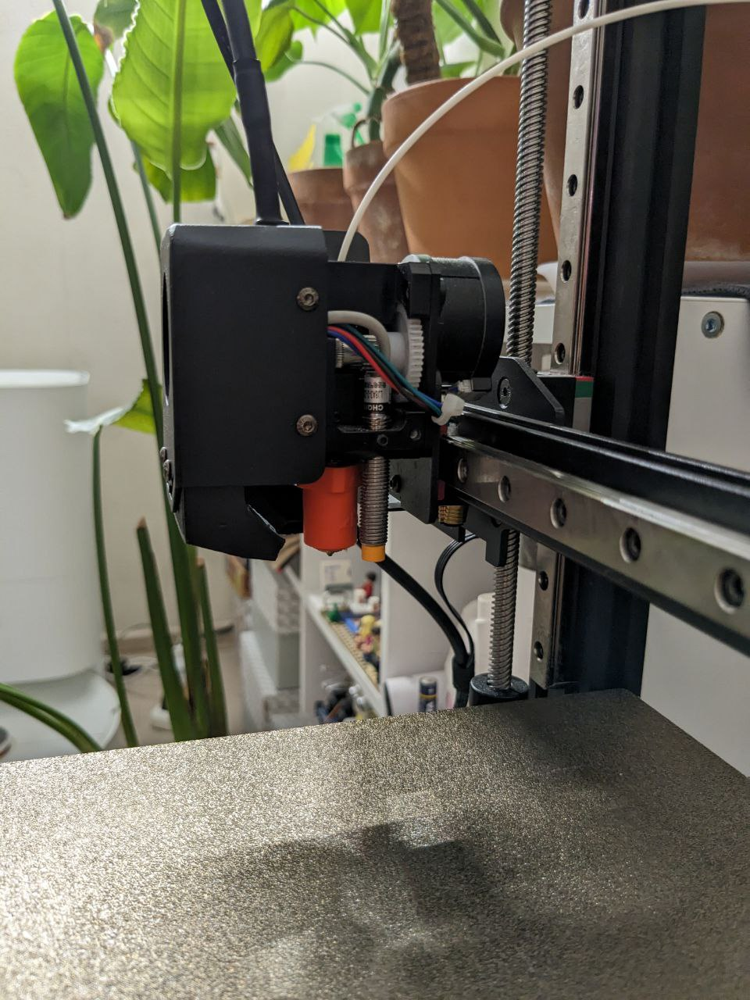
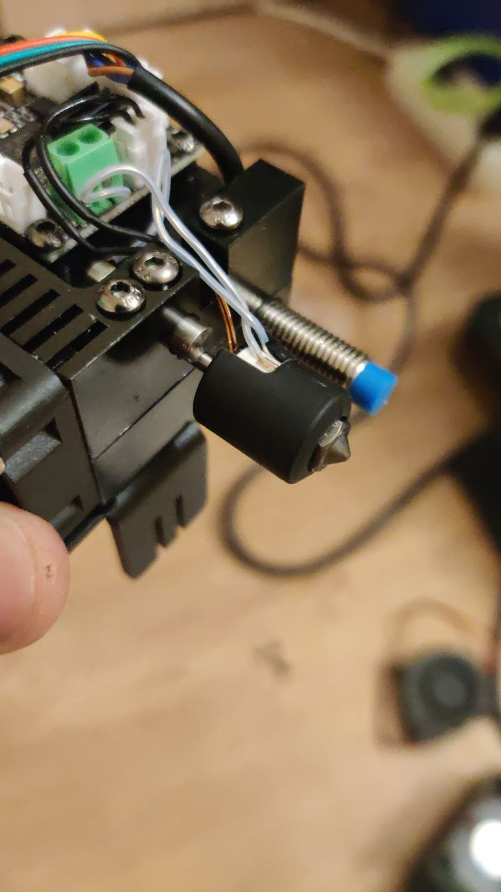
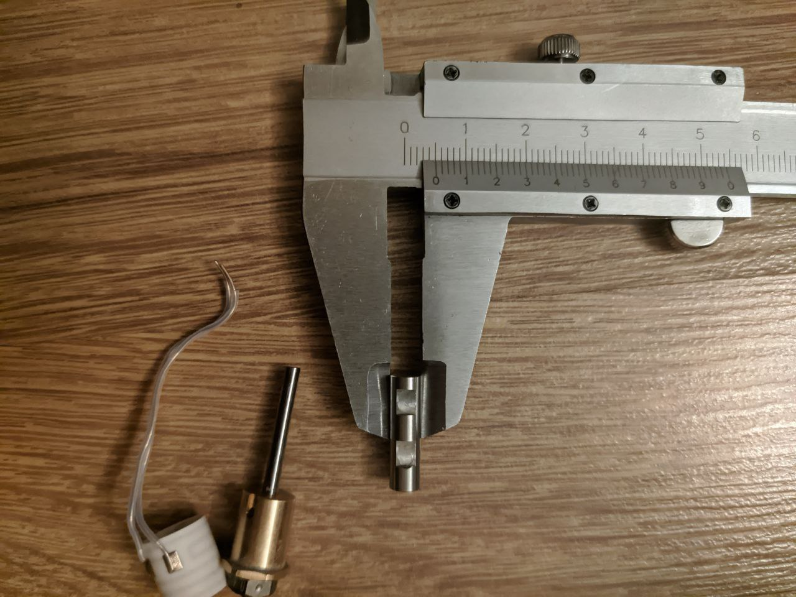

# Установка CHC или CHC pro

## Первые ревизии

В зависимости от того какая ревизия принтера у вас, стоковый хитблок можно заменить на более качественный от CHC/CHC Pro от Trianglelab

#### На версию с экраном под стоковый обдув подходит [CHC](https://aliexpress.ru/item/1005002781227348.html)

#### На версию без экрана под стоковый обдув подходит [CHC Pro](https://aliexpress.ru/item/1005004224332574.html)

В обоих случаях используется горло длинной 25 мм, можно использовать либо стоковое, либо от [V5 ANYCUBIC Vyper](https://aliexpress.ru/item/1005003943424981.html)

## Более новые ревизии

В последних ревизиях принтера конструкция хитблока значительно изменилась. Теперь хитблок и горло составляют единое целое. В этих ревизиях заменить хитблок на CHC не представляется возможным

