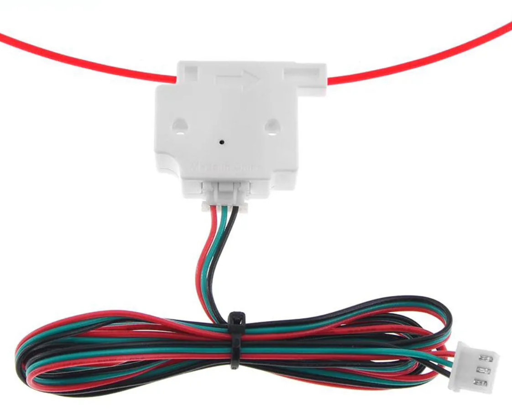
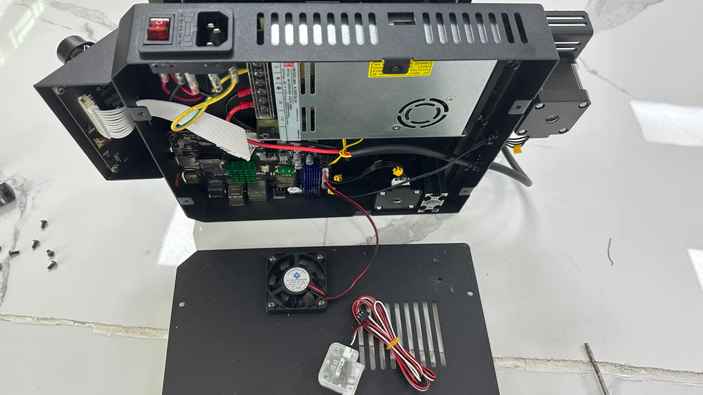
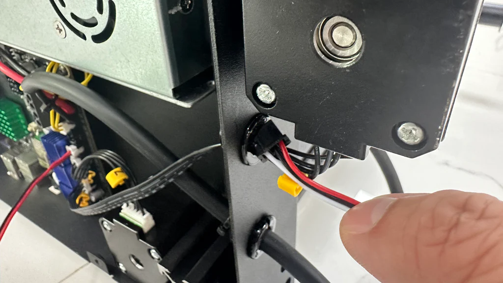
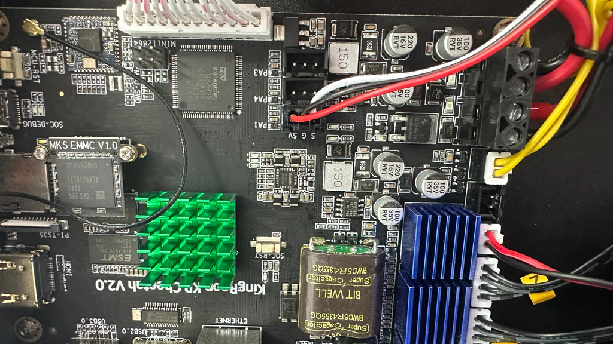
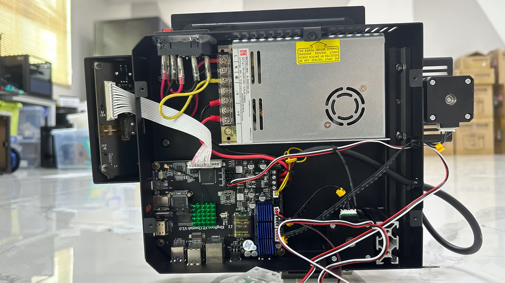
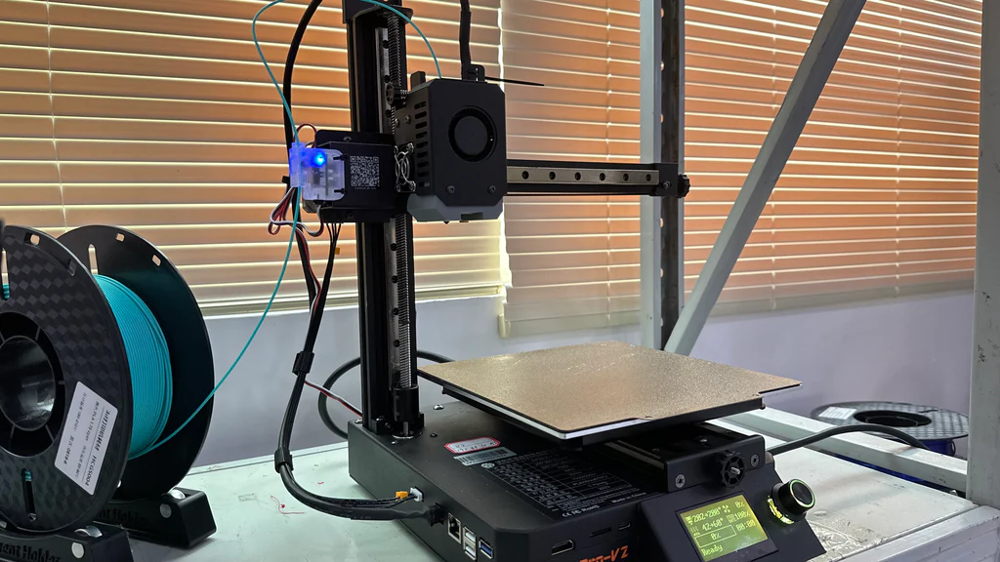

# Установка датчика окончания филамента

> Оригинал статьи [тут](https://kingroon.com/blogs/3d-print-101/enable-filament-run-out-detection-on-your-kingroon-kp3s-pro-v2-in-5-minutes)

Принтер, не имеет датчика окончания филамента, однако, его можно легко установить отдельно

## Шаг 1
Для начала нужно приобрести Модуль обнаружения разрыва нити 3D-принтера Ender 3 CR10

* [Официальный сайт](https://kingroon.com/products/3d-printer-filament-detection-sensor)
* [AliExpress](https://alii.pub/6sjr66)

## Шаг 2
Выключите принтер, снимите нижнюю крышку, затем подключите датчик окончания нити к порту **PA1**

Ввод кабеля оптимальнее выполнить около мотора оси Y, проденьте кабель через отверстие возле него.

Затем подключите его к порту **PA1** и зафиксируйте с помощью пластиковой стяжки.

После этого можно собирать все обратно и подключать отключённые кабели.

## Шаг 3

Датчик имеет кабель длиной более 1 метра, его необходимо закрепить к сущ. кабелям, чтобы не возникало проблем.

Вы можете установить датчик с помощью винтов с левой стороны, как у KP3S Pro S1, или вверху оси Z. Для второго способа лучше напечатать подставку, чтобы направляющая нити шла плавно. Поскольку KP3S Pro V2 печатает с высокой скоростью, крепления с помощью пластиковых стяжек будет недостаточно и крепить лучше на винты.

Как только вы включите принтер и вставите филамент, датчик должен загореться синим светом. Таким образом, когда в KP3S Pro V2 закончится филамент, печать будет приостановлена. После добавления филамента нужно перейти в панель управления Klipper, чтобы возобновить печать.