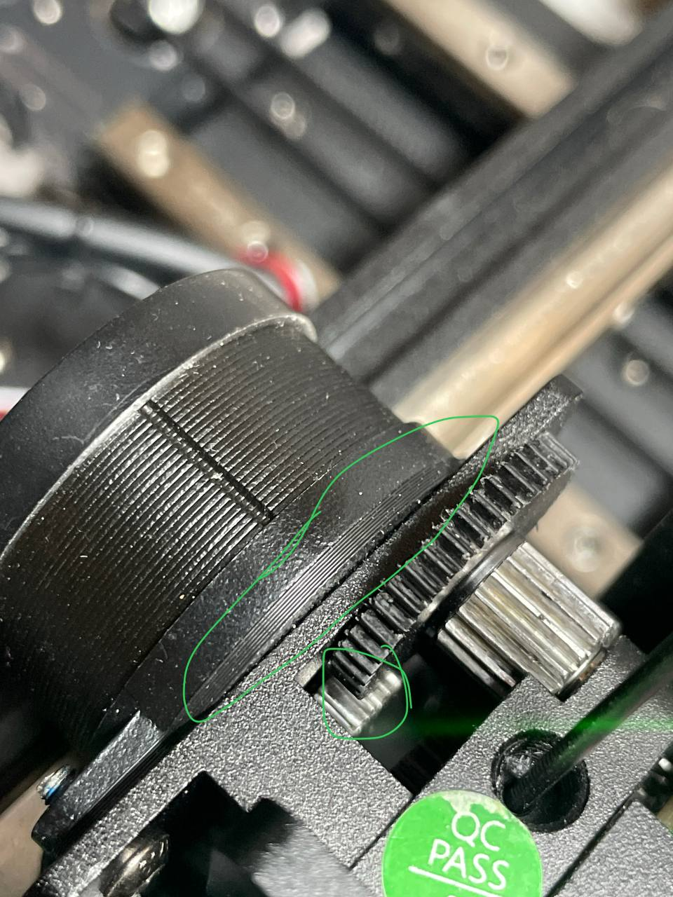

# Проставка между мотором и фидером

Шестерня двигателя не полностью пересекается с шестерней фидера и последняя может быстрее изнашиваться

Рекомендуется распечатать и установить проставку для выравнивания шестерней

## Доработка

1. Скачать [файл проставки](../files/nema-14-junta-kp3s-pro-v2-14mm.stl)
2. Распечатать деталь из PLA, лучше PETG
3. Открутить 2 винта крепления двигателя (для удобства лучше снять кожух головы)
4. Установить проставку как показано на изображении выше
5. Собрать голову в обратном порядке