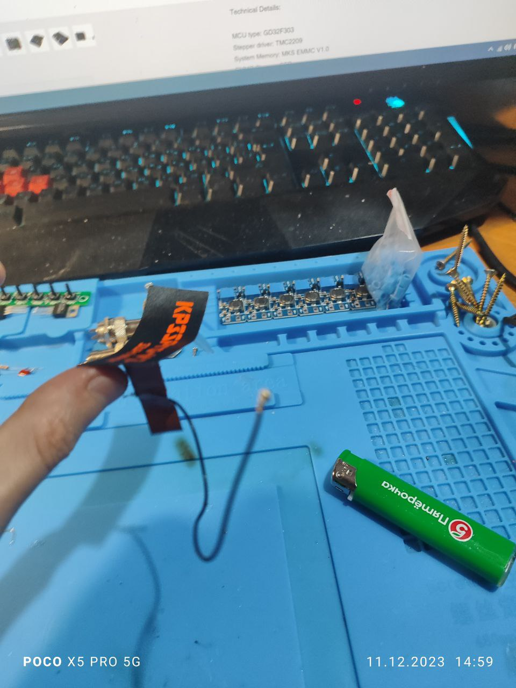
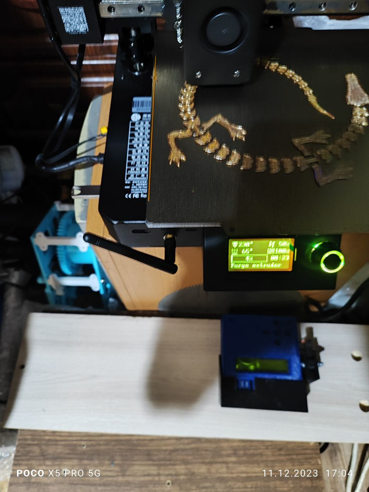

## Замена антенны WLAN

Заводская антенна WLAN (она-же WI-FI) на принтере имеет довольно слабый прием. Дело в том, что ее реализовали в виде наклейки (та, которая с названием модели) на металлическом корпусе.
Близость металлического корпуса не способствует качеству приема:

Поскольку антенна подключена через стандартный разьем типа IPEX, можно заменить ее на что-то более чуствительное, например на внешнюю антенну от ESP32 типа такой:

Нужна антенна поддерживающая 2.4 Mhz и имеющая разьем [типа IPEX](https://en.wikipedia.org/wiki/Hirose_U.FL)
Т.е. отдираем наклейку - под ней стандартное круглое отверстие, через которое проходит кабель антенны к плате 
Отключаем старую антенну, заменяем на новую и перестаем мучаться, что принтер постоянно теряет связь с вашим домашним роутером:

